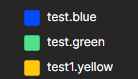

# Icon Pack Theme Demostration

This is an Icon Pack demostration for Graviton Editor.

## Installation

Installing via Graviton Cli
> graviton --install Graviton-Code-Editor/IconDemo

Installing manually on .graviton/plugins

> git clone https://github.com/Graviton-Code-Editor/IconDemo.git
